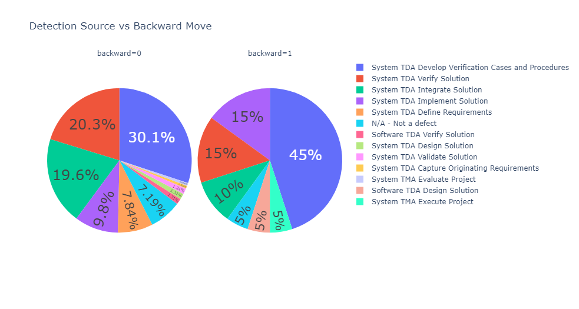

# BH_PCMLAI_CAPSTONE

## Capstone Project for Berkeley Haas - Professional Certificate in Machine Learning and Artificial Intelligence

### Notebook
https://github.com/stormrryder/BH_PCMLAI_CAPSTONE/blob/main/Capstone.ipynb

### Foreword
- This project is designed to analyze proprietary data.
- Given the nature of the data, it is not included in this repository.
- Instead a very small synthetic dataset is included.
- The dataset allows to execute the notebook but will not generate any significant results.

### Background
- Jira is used to track smaller parts of a larger project.
- The Jira issue type used is called a "Work Package".
- Ideally it is similar in size to what is recommended by Agile best practices but at times it can be larger.
- The Work Package workflow is depicted in the figure below.

- When a work package information is complete, mainly the scope of the change, it is submitted to a Change Control Board (CCB).
- The work package is moved to the Pending state.
- The board reviews the information and confirms that the change is necessary and can be accomplished within the schedule and budget constraints.
- Once confirmation is completed, the work package is moved to the Assigned state.
- While in the Assigned state, the team implements the approved change and moves the work package to Closed state when done.

### Problem Statement
- When implementing changes, the team may discover that the effort to complete the work package is higher than estimated by the board.
- In those cases, the team will move the work package back to the Pending state with additional information for a second approval.
- This backward movement disrupt the workflow and adds delays.

### Supporting Data
- Jira has a REST API which allows to download all the fields of the issues.
- It also allows to download the history of the issues which is needed to see the state transitions.
- Initial investigation of this data indicates that backward transitions happened for about 12% of the work packages of a specific project.
- It also revealed that 40 some work packages were moved backward more than once, up to 5 times.

### Objective
1. The primary goal is to detect whether the work package is likely to move backward. This could be used by an engineer submitting a new issue or by the board when reviewing an entry.
2. The secondary goal is to indicate the likely cause of the backward movement.
3. A tertiary goal is to build a model that can be reused by different project. It is suspected that different team working on different products have different reasons for backward movement. But all these projects use the same Jira issue type, with a common structure. The generic model likely must be trained for each project.

### Exploratory Data Analysis

CORRELATION:
- Backward has very low correlation with number of components.
- Features do not have significant correlation between each other.

DATA TYPE: TEXT LENGTH</h4>
- Number of characters for the major text fields does not seem to be an indicator.
- Most issue descriptions are longer than what SBERT can handle. We will need to separate them in smaller chunks, like sentences and then average the results of each.

DATA TYPE: LISTS</h4>
- Issues going backward tends to affect more components.
- Number of affected features or requirements does not seem to be an indicator.

DATA TYPE: CATEGORIES:
- '4C- New Feature' and '4A - Product Improvement' are more likely to move backward. The same can be said about issue type 'Program Planned' and 'Enhancement' are more likely to move backward. There is a known high correlation betwen these as their meaning overlaps.
- Issues detected while developing system verification procedures are more likely to go backward. So are those found while implementing solution.
- Source seems irrelevant as practically all issues are sourced as 'RC' ie internally created.
- However, an externally sourced issue as double chance to go backward.

DATA TYPE: WORDS
- Looking a the top 20 ranked words, we can see a few words that are more frequent within issues that go backward: control, need, ca, new, feature, mode, entry, see, field.
- Some of these words are related to previously observations. New features are more likely to go backward.
- By comparing the words frequency ranking, we can see which words have a strong likelyhood to belong to each category. For example, the words 'src', 'performance' and 'tag' are more likely to show up in issues going backwards. While words 'pba', 'inbd', 'hfom' are more common in issues NOT going backwards.
- Lastly, there are words that show up only in issues that went backwards and other words that only show up in issues NOT going backward.

 backward = 1                         |   backward = 0
:------------------------------------:|:-------------------------:
  |  

### Preliminary Modeling Observations
- Models attempted: LogicalRegression, Decision Tree, Nearest Neighbors, Support Vector Machine, Naive Bayes 
- StandardScaling seems detrimental
- A good recall training score can be obtained but it is difficult to achieve with test set
- F1 and Precision are very challenging as the set is unbalanced and is relatively small.

### Next steps
- Use smote to balance the set
- Use kfold to extend training set
- Explore other models
